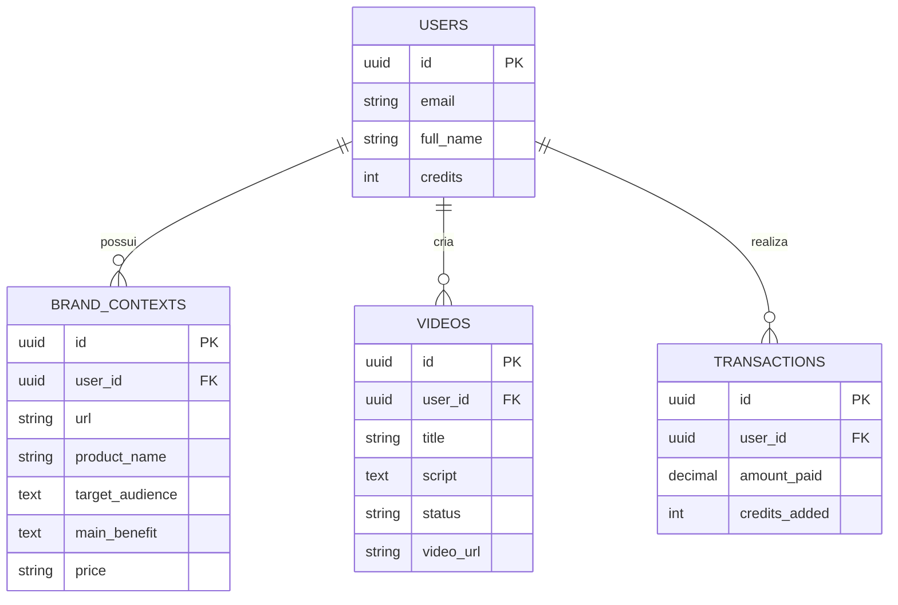

# Mapeamento do Banco de Dados (Hookify)

Para garantir que o nosso aplicativo seja robusto, escalável e funcione com autenticação, precisamos das seguintes tabelas em nosso banco de dados relacional (PostgreSQL / Supabase).

## 1. Tabela `users` (Usuários)
Armazena as informações de conta, autenticação e saldo de créditos.

| Coluna | Tipo | Descrição |
| :--- | :--- | :--- |
| `id` | UUID (PK) | Identificador único gerado pela autenticação (Auth). |
| `email` | String | Email do usuário. |
| `full_name` | String | Nome completo do usuário. |
| `credits` | Integer | Saldo atual de créditos (Ex: 45). Default: `0`. |
| `stripe_customer_id` | String | ID do cliente no Stripe (para cobranças). |
| `created_at` | Timestamp | Data de criação da conta. |

---

## 2. Tabela `brand_contexts` (Configuração da Marca)
Substitui o `localStorage` atual. Salva o contexto base da marca do usuário, usado pela IA para ler o site e gerar os roteiros perfeitos.

| Coluna | Tipo | Descrição |
| :--- | :--- | :--- |
| `id` | UUID (PK) | Identificador único do contexto. |
| `user_id` | UUID (FK) | Relaciona com a tabela `users`. (Um usuário pode ter 1 ou mais contextos se tiver vários negócios). |
| `url` | String | Link do site base. |
| `product_name` | String | O que é a empresa/produto. |
| `target_audience` | Text | Para quem é (Público-alvo). |
| `main_benefit` | Text | Grande promessa/Benefício. |
| `price` | String | Preço ou modelo de cobrança. |
| `updated_at` | Timestamp | Última vez que o usuário extraiu/salvou os dados. |

---

## 3. Tabela `videos` (Vídeos e Roteiros Gerados)
Responsável por popular a tela de "Meus Vídeos" (Histórico). Salva o roteiro, configurações e o status da geração do vídeo final.

| Coluna | Tipo | Descrição |
| :--- | :--- | :--- |
| `id` | UUID (PK) | Identificador único do vídeo. |
| `user_id` | UUID (FK) | Dono do vídeo (relaciona com `users`). |
| `title` | String | Título chamativo gerado pela IA. |
| `script` | Text | O roteiro (gancho principal) que a IA gerou. |
| `style` | String | Estilo do vídeo (Ex: Problema/Solução). |
| `voice_id` | String | Qual locutor IA foi escolhido (Ex: `pt-BR-AntonioNeural`). |
| `broll_mode` | String | Fundo escolhido (IA, Pexels, Gameplay). |
| `status` | Enum | `draft` (só roteiro), `processing` (renderizando), `completed`, `failed`. |
| `video_url` | String | Link do vídeo renderizado no Storage (S3/Supabase Storage) quando concluído. |
| `created_at` | Timestamp | Quando a ideia foi gerada. |

---

## 4. Tabela `transactions` (Faturamento / Recargas)
Histórico de transações para a tela de "Faturamento".

| Coluna | Tipo | Descrição |
| :--- | :--- | :--- |
| `id` | UUID (PK) | ID da transação. |
| `user_id` | UUID (FK) | Usuário que fez a compra. |
| `amount_paid` | Decimal | Valor pago em R$ (Ex: 97.00). |
| `credits_added` | Integer | Quantidade de créditos adicionados na conta. |
| `stripe_session_id`| String | ID da sessão de checkout para estornos ou conciliação. |
| `created_at` | Timestamp | Data e hora da compra. |

## Diagrama de Relacionamento (ERD)

